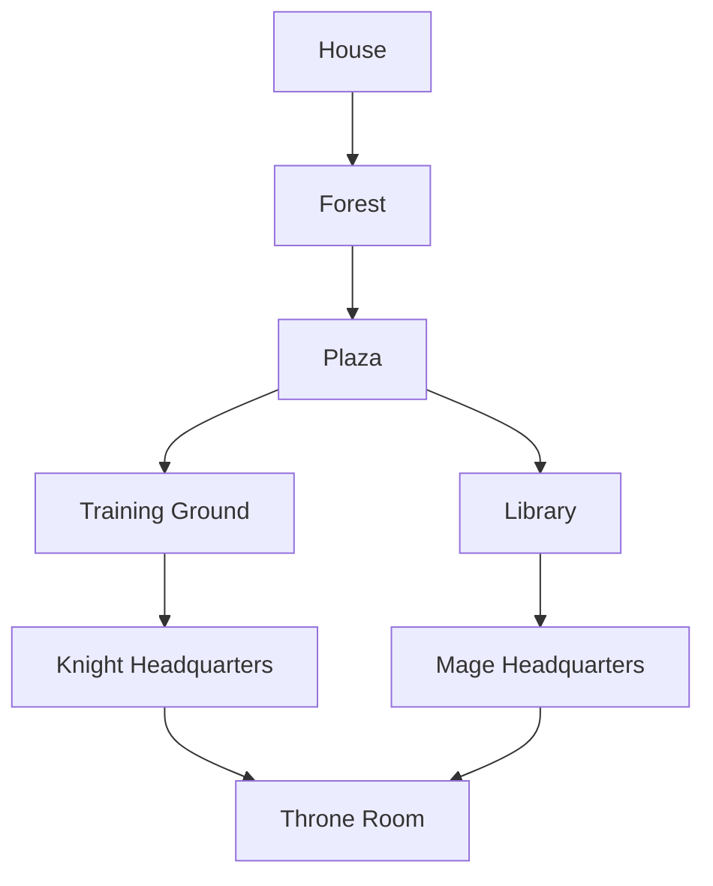

# **Zork**
## Author: Michel Tadros
### [Github Repository](https://github.com/Michel-Tadros/Zork)
### [License](https://github.com/Michel-Tadros/Zork/blob/master/LICENSE)

## **Welcome to Zork!**
On a dark night, you are awoken by the sound of footsteps and laughs. You look around your house and your family ring has disapeared! You realize  the Thief King and his followers have taken it. You must find the Thief King and retrieve the ring!

# **Game Guide**

## How to play:
The user must write the action they want to perform. The actions are divided in 3 categories:
**<ins>Words are case sensitive!**

### <ins>1. One word actions:</ins>
- `knight`: Select "knight" as starting class.
- `mage`: Select "mage" as starting class.
- `up/north`: Move 1 step up.
- `down/south`: Move 1 tile down.
- `left/west`: Move 1 step left.
- `right/east`: Move 1 step right.
- `stats`: Show user stats.
- `inventory`: Show user inventory.
- `look`: Show entities in the same room as the user.
- `equipped`: Show currently equipped item.

### <ins>2. Two words actions:</ins>
- `talk` `"NPC_name"`: Initiate dialogue with the NPC.
- `attack` `"Creature_name"`: Initiate battle with the character.
- `go` `"exit_name"`: Go to the exit and into the next or previous room.
- `equip` `"item_name"`: Equip weapon or armor.
- `open` `"chest_name"`: Open and loot the content of the chest.
- `pick` `"item_name"`: Pick item from the room and add it to the player inventory.
- `drop` `"item_name"`: Remove item from player inventory. **Dropped items cannot be picked up again!**

### <ins>3. Three words actions:</ins>
- `drink` `"potion_type"` `Potion`: Use potion to restore health, magick or stamina. (example: `drink Health Potion`)
- `use` `"key_name"` `Key`: Use key to unlock an exit. (example: `use House Key`)

The following inputs performs the same action as two words but target is a composed name.
- `talk` `"NPC_first_name"` `"NPC_last_name"`: Initiate dialogue with the NPC.
- `attack` `"Creature_first_name"` `"Creature_last_name"`: Initiate battle with the character.
- `go` `"exit_first_name"` `"exit_last_name"`: Go to the exit and into the next or previous room.
- `equip` `"item_first_name"` `"item_last_name"`: Equip weapon or armor.
- `pick` `"item_first_name"` `"item_last_name"`: Pick item from the room and add it to the player inventory.
- `drop` `"item_first_name"` `"item_last_name"`: Remove item from player inventory. **Dropped items cannot be picked up again!**

### <ins>Battle actions:</ins>
After the player has initiated a battle, a new set of actions are given to perform specific task.

**`item_name` can be a composed name!**

- `stats`: Check player stats.
- `inventory`: Check player inventory.
- `equip` `item_name`: Equip item.
- `unequip`: Unequip item.
- `enemy info`: Check enemy stats.
- `drink` `"potion_type"` `Potion`: Use potion to restore health, magick or stamina. (example: `drink Health Potion`)
- `attack`: Player and Creature exchange damage.
- `run`: Flee from battle.

### <ins>Trade actions:</ins>
After the player has initiated a trade, a new set of actions are given to perform specific task.

**`item_name` can be a composed name!**

- `buy` `"item_name"`: Buy item.
- `sell` `"item_name"`: Sell item.
- `exit`: Exit trade.

## Game World
The game consists of 8 rooms, each with different entities. When the player reach room3, they will have 2 options to reach the final room: 

- Room4 -> Room5-> Room8.
- Room6 -> Room7-> Room8.

The player can fully explore all the rooms. Once the final boss, located in room8, is defeated, the game ends and the player has the option to restart or quit the game.

### Rooms Contents:
- Room1 (House): Chest, Thief Squire, Forest exit.
- Room2 (Forest): Thief Apprentice, 2xSunflower, 2x Mushroom, House exit, Plaza exit, Villager, Helper.
- Room3 (Plaza): Merchant, Fellow Knight, Fellow Mage, Helper, Forest exit, Library exit, Training Ground exit.
- Room4 (Training Ground): 2xThief Squire, Iron, Plaza exit, Knight Headquarters exit.
- Room5 (Knight Headquarters): Chest, Thief Knight, Training Ground exit, Throne exit.
- Room6 (Library): 2xThief Apprentice, Quill, Plaza exit, Mage Headquarters exit.
- Room7 (Mage Headquarters): Chest, Thief Mage, Library exit, Throne exit.
- Room8 (Throne): Thief King, Mage Headquarters exit, Knight Headquarters exit.

## Notes:
Thank you so much for playing! Creating this game was such a unique and exciting experience. From writing ideas and drawing diagrams to translating them into code. The hardest step was the first one: How do I begin? But then slowly but surely code blocks were written and connected to finally create the application.
